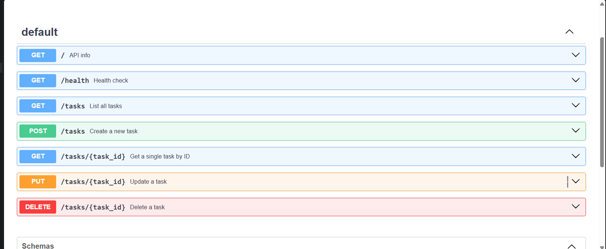

# Task API

A simple in-memory CRUD API for managing a to-do list, built with FastAPI as
part of my internship backend engineering practice. Supports creating,
reading, updating, and deleting tasks. Data lives in memory only — it resets
when the server restarts.

## Setup & Run

\`\`\`bash
git clone https://github.com/Lakshita0901/CRUD_API.git
cd CRUD_API
python -m venv env
env\Scripts\activate      # Windows
pip install fastapi uvicorn
python -m uvicorn main:app --reload
\`\`\`

Server runs at `http://127.0.0.1:8000`
Interactive docs at `http://127.0.0.1:8000/docs`

## Endpoints

| Method | Path            | Description             |
|--------|-----------------|--------------------------|
| GET    | /               | API info                |
| GET    | /health         | Health check             |
| GET    | /tasks          | List all tasks           |
| GET    | /tasks/{id}     | Get a single task        |
| POST   | /tasks          | Create a new task        |
| PUT    | /tasks/{id}     | Update a task            |
| DELETE | /tasks/{id}     | Delete a task             |

## Example request

\`\`\`bash
curl.exe -i -X POST http://127.0.0.1:8000/tasks -H "Content-Type: application/json" -d "@body.json"
\`\`\`

Response:
\`\`\`
HTTP/1.1 201 Created
date: Tue, 04 Aug 2026 09:44:15 GMT
server: uvicorn
content-length: 40
content-type: application/json

{"id":4,"title":"Buy milk","done":false}
\`\`\`

## Swagger UI

