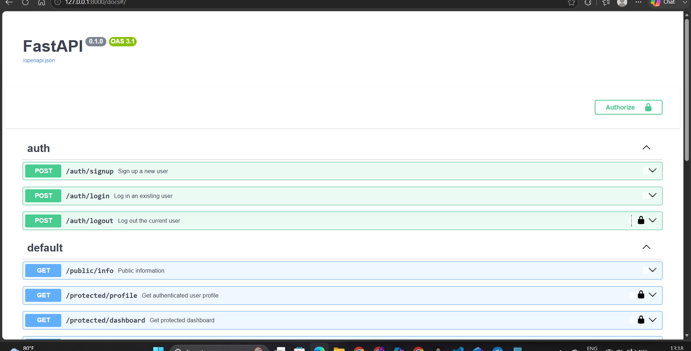

CRUD Task API — SQLite → PostgreSQL (Dockerized) → Auth with Supabase
A Task Management REST API built with FastAPI, SQLModel, PostgreSQL, and Supabase Auth, fully containerized with Docker. This project has evolved across four stages:
Assignment 1 — in-memory task list (no persistence)
Assignment 2 — SQLite database (local file-based persistence)
Assignment 3 — PostgreSQL running in Docker, with the whole stack (app + database) started via a single `docker compose up` command
Assignment 4 (this update) — Authentication: signup, login, logout, and protected routes secured with Supabase-issued JWTs
At every stage, the core Task API's routes, status codes, and response shapes have stayed the same. Each assignment added a new layer underneath or alongside it, without rewriting what already worked.
---
What this project is
A REST API for managing tasks, now with real user authentication in front of it. Previously every endpoint was wide open — anyone who knew the URL could read, create, or delete data. This update introduces a proper trust triangle:
```
Client → signs up / logs in → Supabase (Identity Provider) → issues a JWT
Client → sends JWT in Authorization header → This FastAPI server
This server → verifies the JWT with Supabase → grants or denies access
```
Supabase handles all the actual password storage, hashing, and token issuing — this project never touches raw passwords or writes its own cryptography, which is the correct, safe way to do authentication in a real backend.
---
Why PostgreSQL + Docker (Assignment 3)
SQLite was great for learning the basics of persistence, but it has real limitations: it doesn't run as a standalone server, doesn't handle concurrent writes well, and isn't how real production backends are typically deployed.
This stage moved to PostgreSQL, containerized with Docker, because:
Matches real-world backend setups — most production APIs talk to a client-server database like Postgres, not a single file.
Docker removes "works on my machine" problems — anyone cloning this repo gets the exact same database version and config, with zero manual Postgres installation.
`docker compose up` starts the entire stack — the API and the database boot together, wired to talk to each other automatically.
Data persists in a Docker volume, independent of the containers themselves — containers can be destroyed and recreated, and the data survives.
What changed vs. the SQLite version
Nothing changed in the service or route logic. Every task endpoint — `GET /tasks`, `POST /tasks`, `PUT /tasks/{id}`, `DELETE /tasks/{id}`, `GET /stats`, `POST /reset` — is byte-for-byte the same code as the SQLite version.
The only things that changed:
The connection string — `create_engine("sqlite:///tasks.db")` became `create_engine(os.getenv("DATABASE_URL"))`, reading a Postgres URL from environment variables instead of a hardcoded SQLite path.
The database itself — now runs as a Postgres container instead of a local file.
Table creation — in addition to SQLModel's automatic `create_all()`, an explicit `init.sql` script was added so the table and seed data can also be created via raw SQL on first container startup (per the assignment requirement).
This is the proof that assignment asked for: swapping the entire storage backend was a one-line change to the connection string, not a rewrite of the application.
---
Tech Stack
Layer	Technology
API Framework	FastAPI
Data validation	Pydantic
ORM / DB layer	SQLModel
Database	PostgreSQL 16
Identity Provider	Supabase Auth
Containerization	Docker + Docker Compose
API docs	Swagger UI (`/docs`), with Bearer auth configured
Server	Uvicorn
---
Project Structure
```
CRUDapi/
├── main.py               # Task CRUD routes (unchanged) + includes the auth/protected routers
├── auth.py                 # /auth/signup, /auth/login, /auth/logout
├── protected.py             # /public/info, /protected/profile, /protected/dashboard
├── dependencies.py           # get_current_user — the reusable auth dependency ("middleware")
├── supabase_client.py         # initializes and exports the Supabase client
├── init.sql                    # SQL script that creates the `task` table and seeds 3 example tasks
├── Dockerfile                    # Builds the FastAPI app into a container image
├── docker-compose.yml              # Defines and wires together the app + db services
├── requirements.txt                 # Python dependencies
├── .env                            # Local env vars (gitignored) — DATABASE_URL, SUPABASE_URL, SUPABASE_KEY
├── .env.example                      # Committed template showing required env vars
├── .dockerignore
├── .gitignore
└── README.md                          # This file
```
---
How to set up local environment variables
1. Create a free Supabase project
Go to supabase.com and sign up
Create a new project
Go to Project Settings → API
Copy the Project URL (looks like `https://xxxxxxxxxxxxx.supabase.co` — not the dashboard URL in your browser's address bar, which is a different thing)
Copy the anon public key (not the secret/service key — those must never be used here)
2. Copy the example env file
```bash
cp .env.example .env
```
3. Fill in `.env`
```env
DATABASE_URL=postgresql://postgres:postgres@db:5432/tasksdb
SUPABASE_URL=https://your-project-ref.supabase.co
SUPABASE_KEY=your_anon_public_key
```
> Note: the database host here is `db`, not `localhost` — this matches the service name defined in `docker-compose.yml`, which Docker's internal network uses to let the `app` container find the `db` container.
`.env` is listed in `.gitignore` and is never committed. Only `.env.example` (with placeholder values) is pushed to GitHub.
---
How to run this project
1. Clone the repository
```bash
git clone https://github.com/Lakshita0901/CRUD_API
cd CRUDapi
```
2. Set up environment variables (see above)
3. Start the whole stack
Make sure Docker Desktop is running, then:
```bash
docker compose up --build
```
This single command:
Builds the FastAPI app image
Starts a PostgreSQL 16 container with a persistent volume (`pgdata`)
Waits for Postgres to report healthy before starting the app (via a healthcheck)
Runs `init.sql` automatically on first startup to create the `task` table and seed 3 example tasks
Starts the FastAPI app, connected to both Postgres and Supabase
4. Explore the API
```
http://127.0.0.1:8000/docs
```
(Use `127.0.0.1`, not `0.0.0.0` — the latter only makes sense from inside the container.)
5. Stop the stack
```bash
docker compose down
```
This stops and removes the containers, but not the `pgdata` volume — your data is preserved for next time. To wipe the data completely and start fully fresh (e.g. to re-test the SQL init script), use:
```bash
docker compose down -v
```
---
API Reference
Method	Endpoint	Auth required	Description
POST	`/auth/signup`	No	Create a new user account via Supabase
POST	`/auth/login`	No	Authenticate and receive an access token + refresh token
POST	`/auth/logout`	Yes	Terminate the current session
GET	`/public/info`	No	Public, unprotected sample data
GET	`/protected/profile`	Yes	Read the authenticated user's own profile (id, email, created_at)
GET	`/protected/dashboard`	Yes	A second protected route, proving the auth dependency is reusable
GET	`/tasks`	No	List all tasks (supports `?done=` and `?search=` filters)
GET	`/tasks/{id}`	No	Get a single task by ID
POST	`/tasks`	No	Create a new task
PUT	`/tasks/{id}`	No	Update an existing task
DELETE	`/tasks/{id}`	No	Delete a task
GET	`/stats`	No	Get task statistics (total / done / open)
POST	`/reset`	No	Reset the database back to the 3 seed tasks
GET	`/health`	No	Health check
(Task endpoints are not yet gated behind auth — that would be a natural next step, but was outside the scope of this assignment.)
Status codes
Situation	Code
Task created	`201`
Task deleted	`204`
Invalid task input	`400`
Unknown task id	`404`
Signup success	`201`
Login success	`200`
Missing email/password on signup or login	`400`
Wrong credentials on login	`401` — `{"error": "Invalid login credentials"}`
Missing/malformed Authorization header on a protected route	`401` — `{"error": "Access token required"}`
Invalid or expired token on a protected route	`401` — `{"error": "Invalid or expired token"}`
Logout success	`204`
---
Table creation — SQL init script (Assignment 3)
Instead of relying only on SQLModel's Python-based `create_all()`, the `task` table is also defined explicitly in `init.sql`:
```sql
CREATE TABLE IF NOT EXISTS task (
    id SERIAL PRIMARY KEY,
    title TEXT NOT NULL,
    done BOOLEAN NOT NULL DEFAULT FALSE
);

INSERT INTO task (title, done)
SELECT * FROM (VALUES
    ('Buy milk', FALSE),
    ('Walk the dog', FALSE),
    ('Finish assignment', TRUE)
) AS seed(title, done)
WHERE NOT EXISTS (SELECT 1 FROM task);
```
This file is mounted into Postgres's official auto-init folder (`/docker-entrypoint-initdb.d/`) via `docker-compose.yml`. Postgres runs any `.sql` file found there automatically, but only the first time it starts against a completely empty volume — on every subsequent startup, it detects existing data and skips re-running it. This was verified directly:
```bash
docker compose logs db
```
showed the line:
```
running /docker-entrypoint-initdb.d/init.sql
```
on a fresh volume, and
```
PostgreSQL Database directory appears to contain a database; Skipping initialization
```
on a volume that already had data — confirming the script only seeds once.
---
Persistence check — how Postgres persistence was verified (Assignment 3)
This was the core requirement of the Docker assignment: proving that data survives not just an app restart, but a full container restart.
Steps taken:
Started the stack with `docker compose up`.
Created a new task via `POST /tasks`:
```json
   { "title": "final persistence check" }
   ```
Response confirmed `201` and `id: 4`.
Verified it existed via `GET /tasks` — 4 tasks total.
Fully stopped and removed both containers:
```bash
   docker compose down
   ```
Restarted the stack from scratch:
```bash
   docker compose up
   ```
Called `GET /tasks` again.
Result: all 4 tasks — including "final persistence check" — were still present, even though both the `app` and `db` containers had been completely destroyed and recreated in between. This confirms the data lives in the named Docker volume (`pgdata`), not in the containers themselves, satisfying the persistence requirement.
---
Honesty note on the "repository" requirement (Assignment 3)
The assignment asked for "a Postgres repository implementing the same interface as your in-memory one." This project does not have a formally separated repository class with an explicit interface — instead, SQLModel's `Session` object is used directly inside each route (the same pattern used in the SQLite version). What did stay constant, and what genuinely proves the architecture:
Every route function signature, validation rule, and response shape is unchanged from the SQLite version.
The only code that changed to move from SQLite → Postgres was the single line building `engine` from `DATABASE_URL`.
So while there isn't a dedicated repository abstraction layer, the practical outcome the assignment was testing for — that swapping storage backends requires touching only one line, not the routes — was fully demonstrated.
---
How token verification works (Assignment 4)
`GET /protected/profile`, `GET /protected/dashboard`, and `POST /auth/logout` all depend on a single reusable FastAPI dependency, `get_current_user` (in `dependencies.py`):
FastAPI's built-in `HTTPBearer` security scheme extracts the token from the `Authorization: Bearer <token>` header — including correctly stripping the "Bearer " prefix — without any manual string parsing.
The extracted token is passed to `supabase.auth.get_user(token)`.
If Supabase reports the token invalid, expired, or tampered with, the dependency raises a `401` before the route's own logic ever runs.
If valid, the dependency returns the verified user object, which the route can use directly (e.g. to build the profile response).
Because this is a dependency rather than logic duplicated in every route, adding auth to a new endpoint is a one-line change: `Depends(get_current_user)`.
---
Swagger UI / Bearer auth (Assignment 4)
`/docs` is configured with FastAPI's `HTTPBearer` scheme, so:
Protected routes show a padlock icon
A green "Authorize" button appears at the top of the page
Pasting a raw access token there (no need to type "Bearer " manually) authorizes every subsequent "Try it out" call in the session
Screenshot:

---
How auth was tested (Assignment 4)
All checkpoints were verified manually through Swagger UI (`/docs`), in this order:
Signup — `POST /auth/signup` with a test email/password → confirmed `201` with a real Supabase user object returned (id, email, timestamps).
Login before email confirmation — initially returned `401 Invalid login credentials`, because Supabase's default email-confirmation requirement blocked the account. Resolved by manually confirming the test user's `email_confirmed_at` field directly in Supabase's Table Editor (`auth.users` table), since this project doesn't have a frontend to receive the confirmation redirect.
Login after confirmation — `POST /auth/login` → confirmed `200` with a real `access_token` and `refresh_token`.
Public route — `GET /public/info` → confirmed `200`, no auth needed.
Protected route without a token — `GET /protected/profile` → confirmed `401`, `{"error": "Access token required"}`.
Authorized via Swagger's "Authorize" button with the real access token.
Protected route with a valid token — `GET /protected/profile` → confirmed `200` with real user data.
Second protected route with the same token — `GET /protected/dashboard` → confirmed `200`, proving the auth dependency generalizes across routes rather than being route-specific.
Protected route with a deliberately broken token → confirmed `401`, `{"error": "Invalid or expired token"}`.
Logout — `POST /auth/logout` with a valid token → confirmed `204 No Content`.
All ten checkpoints passed.
---
A note on Supabase email confirmation
By default, Supabase requires a user to click a confirmation link (sent by email) before their account can log in. Since this project has no frontend to host the confirmation redirect page, that link points to an unreachable `localhost:3000` and expires quickly, which blocked login during testing.
For local development and testing purposes, test accounts were confirmed manually via Supabase's Table Editor rather than disabling email confirmation project-wide, so that Supabase's default security behavior stays intact for anyone who later connects a real frontend to this project.
---
Notes for anyone cloning this repo
Clone the repo, `cp .env.example .env`, and fill in your own Postgres connection string plus your own Supabase project URL/anon key.
Run `docker compose up --build`.
Sign up a test user via `/docs`.
If Supabase's email confirmation is enabled on your project (it is, by default), either confirm the account via the emailed link or manually set `email_confirmed_at` in your Supabase project's `auth.users` table before attempting to log in.
Everything else — task CRUD, login, protected routes, Swagger authorization, and Docker persistence — works exactly as described above.
